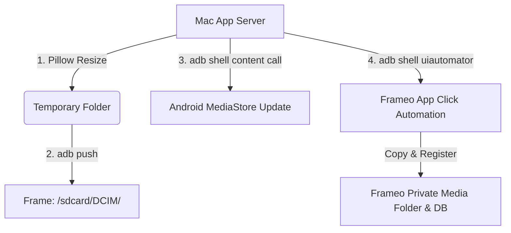

# Frameo Linker: Digital Frame Media Synchronizer & Manager

Frameo Linker is a premium, web-based pair-programming utility designed for macOS (or any system running ADB) that enables fast, wireless photo and video transfers to Android-based Frameo digital photo frames.

It replaces the slow, manual, and cloud-reliant Frameo mobile app with a direct local link over Android Debug Bridge (ADB). It features ambient dark-mode aesthetics, dynamic progress tracking, and full screen-automation utilities.

---

## Key Features

1. **🚀 Beam Files (Drag-and-Drop)**: Quick-upload files or folders via drag-and-drop or file pickers. Pushed files are optimized (resized to screen specifications to save space), transferred via ADB to `/sdcard/DCIM/`, and registered with the Android MediaStore.
2. **🔄 Local Folder Sync**: Specify an absolute directory path on your Mac to sync thousands of photos recursively. Includes a **Lazy Deduplication** engine that checks file sizes on the device and skips files already sent to save transfer time and bandwidth.
3. **📱 Device Gallery & Manager**:
   - **Disk Space Metrics**: Dynamically display total/free space on the frame (`df /sdcard`).
   - **On-the-fly Thumbnail Grid**: View files directly inside `/sdcard/frameo_files/media/` streamed over wireless ADB using binary-safe `exec-out` streaming (zero cache footprint on your Mac).
   - **Remote Deletion**: Delete photos physically from the frame, removing them from the slideshow player.
   - **Local Favorites**: Star files to save favorites locally in a `favorites.json` database on your Mac.
4. **🤖 Click Automation (UI Automator)**: Triggering **"Automate Import"** wakes the frame's screen, resets the app, opens the import settings menu, and simulates clicks on **"Select all"** and **"Import"** to pull the files into Frameo's database.

---

## How It Works



Since the application runs locally on your Mac, it has direct access to your local folders and can execute ADB commands to communicate with the frame. Media files are sent to the frame's transfer zone (`DCIM/`), scanned, and then imported into the official slideshow database via simulated screen touches.

---

## Setup & Running Instructions

### Prerequisites
- **Python 3**: Ensure Python 3 is installed on your Mac.
- **ADB (Android Debug Bridge)**: Install ADB via Homebrew if you haven't already:
  ```bash
  brew install android-platform-tools
  ```

### Step 1: Connect and Trust the Frame
1. Connect the Frameo to your Mac using a USB data cable.
2. On the Frameo screen, tap **Settings → About**.
3. Scroll down and toggle **Beta Program** to **ON**.
4. Scroll to the bottom and toggle the new **ADB Access** setting to **ON**.
5. In a terminal on your Mac, run:
   ```bash
   adb devices
   ```
6. Look at the frame's screen. Accept the debugger trust popup and check **"Always allow from this computer"**.
7. Switch the device to listen on wireless port 5555:
   ```bash
   adb tcpip 5555
   ```
8. Unplug the USB cable. You are now ready to connect wirelessly using the frame's IP address!

### Step 2: Start the Web App
Run the launcher script in the repository folder:
```bash
./run.sh
```
This script will automatically:
- Create a Python virtual environment (`.venv`).
- Install dependencies (`Flask`, `Pillow`).
- Launch the web server on `http://127.0.0.1:5001`.
- Open the user interface in your default web browser.

---

## Configuration & Troubleshooting FAQ

### Q1: I get `adb: device unauthorized` or `this adb server's $ADB_VENDOR_KEYS is not set`. How do I fix this?
**A:** This is a misleading ADB error. It does **not** mean you need vendor keys; it simply means your computer is plugged in but the frame has not trusted it yet.
1. Connect via USB.
2. Make sure both **Beta Program** and **ADB Access** are toggled **ON** in Settings.
3. Keep the screen active, run `adb devices` in your terminal, and look for the popup prompt on the frame to click **Always allow** and **OK**.

### Q2: I transferred the photos successfully, but they don't show up in my slideshow. Why?
**A:** Pushing files to Android storage is like inserting an SD card—Frameo won't play them until they are officially imported. 
- You can manually import them on the frame: tap **Settings → Manage photos → Import photos**, select the photos, and click the Import icon.
- Alternatively, click the **"Automate Import"** button in the web UI. This will execute the clicks on the frame screen for you.

### Q3: How does the Local Folder Sync handle folders with thousands of files?
**A:** Standard HTML uploads fail on large folders due to browser timeouts. The **Sync Local Folder** tab reads files directly from your Mac's hard drive and streams progress dynamically via Server-Sent Events (SSE). It reads the sizes of files already in the frame's `/sdcard/DCIM/` folder and skips pushing files that match in name and size, ensuring subsequent syncs complete in seconds.

### Q4: When connecting to USB, the app fails to push files or says "device not found".
**A:** Ensure you input your raw USB serial number (e.g., `7E5C1001`) in the connection input field. The backend checks for the absence of dots/colons to recognize it as a USB connection and skips appending the port suffix `:5555`, preventing target routing failures.

### Q5: Can I delete photos or mark favorites in the web app?
**A:** Yes!
- **Favorites**: Stored in a local `favorites.json` database on your Mac (since the frame's production database is write-protected). Toggling the star displays a badge and lets you filter items.
- **Deletion**: Physically deletes the image file from `/sdcard/frameo_files/media/`. The Frameo slideshow player automatically skips files when their disk source is missing.
